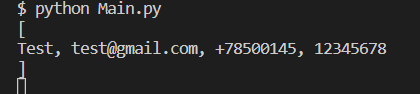

# User Information Entry Form

This is a Python program that creates a Graphical User Interface (GUI) using the Tkinter module. It provides a user-friendly form where users can enter their personal information such as name, email, phone, and password.

## Prerequisites
This program requires Python 3.x and the following Python modules:
- tkinter

## Installation
1. Clone the repository to your local machine or download the source code as a ZIP file and extract it to a folder.
2. Open the terminal or command prompt and navigate to the folder where the source code is located.
3. Run the command python3 main.py to launch the program.

## How to Use
1. Once the program is launched, you will see a GUI window with the user information entry form.
2. Enter your name, email, phone, and password in the respective fields.
3. Click on the Submit button to save your information.
4. If any of the fields are left empty, an error message will appear indicating which field needs to be filled.
5. If all fields are filled, the information you entered will be displayed on the console.

## Program Files
- main.py: This is the main Python file that contains the code for the GUI and the user information entry form.
- design.py: This Python module contains the code for the GUI design, such as window size, color, fonts, and labels.

### App look like this:

Once the program is launched, you will see a GUI window with the user information entry form.

If any of the fields are left empty, an error message will appear indicating which field needs to be filled:

If all fields are filled, the information you entered will be displayed on the console:

This program was created as a personal project to practice GUI programming using Tkinter module.